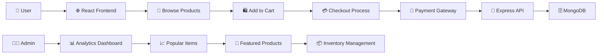

<div align="center">
<h1> 🐾 PawSome Hub - Pet E-Commerce Platform</h1>


[](https://reactjs.org/)
[](https://nodejs.org/)
[](https://www.mongodb.com/)
[](https://paypal.com/)
[](#)
[](#)

> 🛒 **A full-stack e-commerce platform dedicated to our furry friends! Shop for premium pet products with secure payments, real-time inventory, and delightful user experience.**

</div>

---

## 📋 Table of Contents
- [🌟 Key Features](#-key-features)
- [🏗️ Architecture](#️-architecture)
- [🛡️ Security & Payments](#️-security--payments)
- [🚀 Getting Started](#-getting-started)
- [💻 Tech Stack](#-tech-stack)
- [📱 User Experience](#-user-experience)
- [🔧 API Endpoints](#-api-endpoints)
- [🎯 Business Features](#-business-features)

---

## 🌟 Key Features

### 🛍️ **Complete E-Commerce Experience**
- ✅ **Product Catalog**: Browse cats & dogs products (toys, sofas, fountains, accessories)
- ✅ **Smart Search & Filter**: Find perfect products for your pets
- ✅ **Shopping Cart**: Add, remove, and manage quantities seamlessly
- ✅ **Secure Checkout**: Complete purchase process with order confirmation
- ✅ **User Accounts**: Registration, login, and profile management

### 💳 **Advanced Payment System**
- ✅ **Multiple Payment Methods**: Credit Card & PayPal integration
- ✅ **Encrypted Transactions**: AES-256 encryption for sensitive data
- ✅ **Secure Card Storage**: Encrypted card numbers with crypto module
- ✅ **Order Processing**: Complete purchase workflow with confirmations
- ✅ **Payment Validation**: Robust form validation and error handling

### 📊 **Business Intelligence**
- ✅ **Popular Items Analytics**: Track top 3 most purchased products
- ✅ **Featured Products**: Highlight special items and promotions
- ✅ **Inventory Management**: Real-time stock tracking and updates
- ✅ **Sales Analytics**: Monitor sold counters and purchase patterns
- ✅ **User Behavior Tracking**: Analyze shopping cart and checkout data

### 🔐 **Enterprise Security**
- ✅ **Password Encryption**: Bcrypt hashing for user passwords
- ✅ **Session Management**: Secure user authentication and sessions
- ✅ **Data Encryption**: AES encryption for sensitive payment data
- ✅ **CORS Protection**: Cross-origin resource sharing security
- ✅ **Input Validation**: Comprehensive data validation and sanitization

---

## 🏗️ Architecture

<div align="center">

### 🔄 **System Flow Overview**


</div>

### 🏛️ **System Architecture**

<table>
<tr>
<td width="50%">

#### 🎨 **Frontend (React)**
- **`src/App.js`** - Main application component
- **`src/components/`** - Reusable UI components
- **React Router** - Client-side navigation
- **Axios** - HTTP client for API calls
- **React Icons** - Beautiful iconography

#### 🔧 **Backend (Node.js/Express)**
- **`server/index.js`** - Main server application
- **`server/models/`** - MongoDB data models
- **Express.js** - RESTful API framework
- **Middleware** - CORS, body parsing, sessions

</td>
<td width="50%">

#### 🗄️ **Database Models**
- **`Users.js`** - User authentication & profiles
- **`Items.js`** - Product catalog & inventory
- **`CartItem.js`** - Shopping cart management
- **`UserFormData.js`** - Order & payment data

#### 💳 **Payment Integration**
- **PayPal SDK** - Secure payment processing
- **Crypto Module** - Card encryption/decryption
- **Form Validation** - Payment data verification
- **Order Processing** - Complete checkout workflow

</td>
</tr>
</table>

---

## 🛡️ Security & Payments

### 🔐 **Security Implementation**

#### **Data Encryption**
```javascript
// AES-256 encryption for sensitive payment data
const cipher = crypto.createCipheriv('aes-256-cbc', encryptionKey, iv);
let encryptedCardNumber = cipher.update(cardNumber, 'utf8', 'hex');
```

#### **Password Security**
```javascript
// Bcrypt hashing for user passwords
const hashedPassword = await bcrypt.hash(password, saltRounds);
```

### 💳 **Payment Processing**
- **PayPal Integration**: `@paypal/react-paypal-js` for secure transactions
- **Credit Card Support**: Encrypted card storage and processing
- **PCI Compliance**: Following payment security standards
- **Transaction Validation**: Multi-layer payment verification

### 🛡️ **Security Layers**

| Layer | Technology | Purpose |
|-------|------------|---------|
| **Authentication** | Bcrypt + Sessions | User login security |
| **Data Encryption** | AES-256-CBC | Payment data protection |
| **API Security** | CORS + Validation | Request filtering |
| **Session Management** | Express Sessions | User state management |
| **Input Sanitization** | Body Parser | Data validation |

---

## 🚀 Getting Started

### Prerequisites
```bash
# Node.js and npm
node --version  # v14+ required
npm --version   # v6+ required

# MongoDB (local or cloud)
# PayPal Developer Account for payment integration
```

### Installation

#### **1. Clone Repository**
```bash
git clone https://github.com/GaiShukrun/PawSome-Hub.git
cd PawSome-Hub
```

#### **2. Install Dependencies**
```bash
# Install frontend dependencies
npm install

# Install backend dependencies
cd server
npm install
cd ..
```

#### **3. Environment Setup**
```bash
# Create .env file in server directory
cd server
echo "MONGODB_URI=your-mongodb-connection-string" > .env
echo "PAYPAL_CLIENT_ID=your-paypal-client-id" >> .env
```

#### **4. Database Configuration**
```javascript
// Update server/index.js with your MongoDB URI
mongoose.connect("your-mongodb-connection-string")
```

#### **5. Start Development Servers**
```bash
# Terminal 1: Start backend server
cd server
npm start

# Terminal 2: Start frontend development server
npm start
```

### 🌐 **Access Application**
- **Frontend**: http://localhost:3000
- **Backend API**: http://localhost:5000
- **MongoDB**: Your configured database URL

---

## 💻 Tech Stack

### 🎨 **Frontend Technologies**
```json
{
  "react": "^18.2.0",
  "react-router-dom": "^6.22.1",
  "react-icons": "^5.0.1",
  "axios": "^1.6.7",
  "@paypal/react-paypal-js": "^8.2.0",
  "react-cookie": "^7.1.0"
}
```

### ⚙️ **Backend Technologies**
```json
{
  "express": "^4.18.3",
  "mongoose": "^8.2.0",
  "bcrypt": "^5.1.1",
  "cors": "^2.8.5",
  "jsonwebtoken": "^9.0.2",
  "express-session": "^1.18.0",
  "cookie-parser": "^1.4.6"
}
```

### 🗄️ **Database & Tools**
- **MongoDB**: NoSQL database for scalable data storage
- **Mongoose**: Elegant MongoDB object modeling
- **Crypto**: Built-in Node.js encryption module
- **Nodemon**: Development server auto-restart
- **EmailJS**: Email service integration

---

## 📱 User Experience

### 🛍️ **Shopping Journey**

```
┌─────────────────┐    ┌──────────────────┐    ┌─────────────────┐
│   Browse Store  │───▶│  Product Details │───▶│  Add to Cart    │
│   🏪 Catalog    │    │  📋 Information  │    │  🛒 Management  │
└─────────────────┘    └──────────────────┘    └─────────────────┘
         │                                               │
         ▼                                               ▼
┌─────────────────┐    ┌──────────────────┐    ┌─────────────────┐
│ User Registration│◀───│   Secure Login   │◀───│  Cart Review    │
│ 📝 Account Setup│    │   🔐 Auth        │    │  📊 Summary     │
└─────────────────┘    └──────────────────┘    └─────────────────┘
                                                         │
                                                         ▼
┌─────────────────┐    ┌──────────────────┐    ┌─────────────────┐
│ Order Complete  │◀───│ Payment Process  │◀───│  Checkout Form  │
│ ✅ Confirmation │    │ 💳 Secure Pay    │    │  📋 Details     │
└─────────────────┘    └──────────────────┘    └─────────────────┘
```

### 🎯 **Key User Features**
- **Intuitive Navigation**: Easy product discovery and browsing
- **Responsive Design**: Seamless experience across all devices
- **Real-time Updates**: Live inventory and cart synchronization
- **Secure Checkout**: Multiple payment options with encryption
- **Order Tracking**: Complete purchase history and confirmations

---

## 🔧 API Endpoints

### 🛒 **Product Management**
```javascript
GET    /api/get-featured-items          // Fetch featured products
GET    /api/get-featured-items/:itemId  // Get specific product details
GET    /api/get-popular-items           // Get top 3 popular items
```

### 🛍️ **Shopping Cart**
```javascript
GET    /api/get-items-in-cart/:username // Fetch user's cart items
GET    /api/carts/:username             // Process cart checkout
POST   /api/add-to-cart                 // Add item to cart
DELETE /api/remove-from-cart            // Remove cart item
```

### 👤 **User Management**
```javascript
POST   /api/register                    // User registration
POST   /api/login                       // User authentication
GET    /api/profile/:username           // Get user profile
PUT    /api/update-profile              // Update user information
```

### 💳 **Payment Processing**
```javascript
POST   /api/saveFormData                // Save encrypted payment data
GET    /api/getFormData/:username       // Retrieve order history
POST   /api/process-payment             // Handle payment transactions
```

---

## 🎯 Business Features

### 📊 **Analytics & Insights**
- **Popular Products**: Automatic tracking of top-selling items
- **Sales Metrics**: Real-time sold counters and revenue tracking
- **User Behavior**: Shopping cart abandonment and conversion rates
- **Inventory Alerts**: Low stock notifications and reorder points

### 🏪 **Store Management**
- **Product Catalog**: Easy addition and management of pet products
- **Featured Items**: Promotional product highlighting system
- **Inventory Control**: Real-time stock level management
- **Order Processing**: Automated order fulfillment workflow

### 💼 **Business Intelligence**
```javascript
// Popular items aggregation pipeline
const popularItems = await UserFormData.aggregate([
  { $unwind: '$itemsCheckout' },
  { $group: { _id: '$itemsCheckout', count: { $sum: 1 } } },
  { $sort: { count: -1 } },
  { $limit: 3 }
]);
```

---

## 🌟 Innovation Highlights

- **🥇 Pet-Focused Design**: Specialized e-commerce for pet products
- **🔧 Full-Stack Excellence**: Complete MERN implementation
- **🛡️ Security First**: Enterprise-grade payment encryption
- **📊 Data-Driven**: Built-in analytics and business intelligence
- **🎨 Modern UX**: Responsive, intuitive user interface

---

## 🎓 Educational Value

### **Learning Outcomes**
- **Full-Stack Development**: Complete MERN stack implementation
- **E-Commerce Architecture**: Real-world online store development
- **Payment Integration**: Secure payment processing systems
- **Database Design**: MongoDB schema and relationship modeling
- **Security Implementation**: Encryption and authentication best practices

### **Professional Skills**
- **React Development**: Modern frontend framework mastery
- **Node.js/Express**: Backend API development
- **Database Management**: MongoDB operations and optimization
- **Payment Systems**: PayPal and credit card integration
- **Security Engineering**: Data encryption and user authentication

---

## 🤝 Contributing

### **Development Areas**
- Mobile app development (React Native)
- Advanced analytics dashboard
- AI-powered product recommendations
- Multi-vendor marketplace features
- International payment methods

### **Getting Involved**
1. Fork the repository
2. Create feature branch (`git checkout -b feature/AmazingFeature`)
3. Commit changes (`git commit -m 'Add AmazingFeature'`)
4. Push to branch (`git push origin feature/AmazingFeature`)
5. Open Pull Request

---

## 📞 Support

- **Issues**: [GitHub Issues](https://github.com/GaiShukrun/PawSome-Hub/issues)
- **Documentation**: Check README and code comments
- **Community**: Join our developer discussions

---

<div align="center">

**🐾 Making Pet Shopping Delightful & Secure 🐾**

*Built with love for our furry friends and modern web technologies*

⭐ **Star this repository to support pet-friendly e-commerce!** ⭐

</div>
